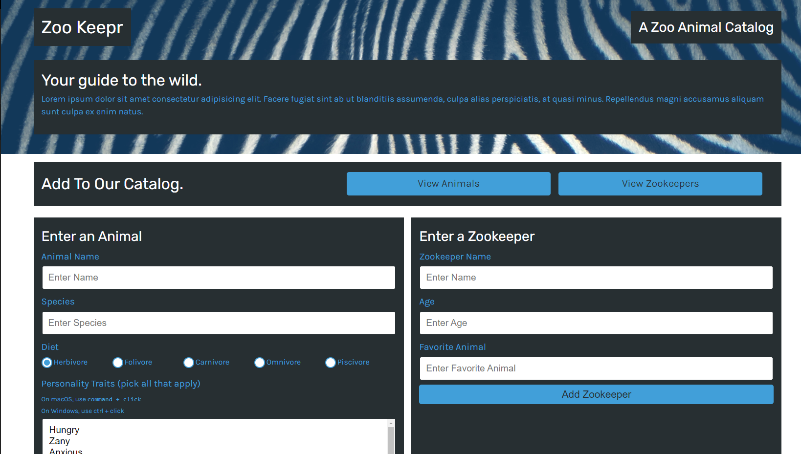

  # zookeeper
  

  ## Description
  Create a front-end application that users can add animals and zookeepers to. Data is stored in JSON format and can be viewed on html pages that are connected through GET and POST requests.

  ## Preview
  

  ## Table of Contents
  * [Installation](#Installation)
  * [Usage](#Usage)
  * [Credits](#Credits)
  * [License](#License)
  * [Contributions](#Contributions)
  * [Test](#Test)
  * [Questions](#Questions)
  

  ## Installation
  The user needs to visit the static Heroku site: https://stormy-springs-46599.herokuapp.com/

  ## Usage
  By entering information in form fields and clicking submit, information is then stored on the server. Users can view stored data on html pages by clicking the links.

  ## License
  
  
  ### MIT License

  Copyright 2022 Claire Rosenfrisk

  Permission is hereby granted, free of charge, to any person obtaining a copy of this software and associated documentation files (the "Software"), to deal in the Software without restriction, including without limitation the rights to use, copy, modify, merge, publish, distribute, sublicense, and/or sell copies of the Software, and to permit persons to whom the Software is furnished to do so, subject to the following conditions:
      
  The above copyright notice and this permission notice shall be included in all copies or substantial portions of the Software.
      
  THE SOFTWARE IS PROVIDED "AS IS", WITHOUT WARRANTY OF ANY KIND, EXPRESS OR IMPLIED, INCLUDING BUT NOT LIMITED TO THE WARRANTIES OF MERCHANTABILITY, FITNESS FOR A PARTICULAR PURPOSE AND NONINFRINGEMENT. IN NO EVENT SHALL THE AUTHORS OR COPYRIGHT HOLDERS BE LIABLE FOR ANY CLAIM, DAMAGES OR OTHER LIABILITY, WHETHER IN AN ACTION OF CONTRACT, TORT OR OTHERWISE, ARISING FROM, OUT OF OR IN CONNECTION WITH THE SOFTWARE OR THE USE OR OTHER DEALINGS IN THE SOFTWARE.
  

  ## Contributions
  The template and instructions for this application were provided by Trilogy Education Services, LLC and the University of Minnesota Fullstack Bootcamp, 2022.

  ## Test
  n/a

  
  ## Questions
  If you have any questions about this project, please contact me directly at claire.rosenfrisk@gmail.com. You can view more of my work on 
   [My GitHub Profile](https://github.com/crosenfrisk).

